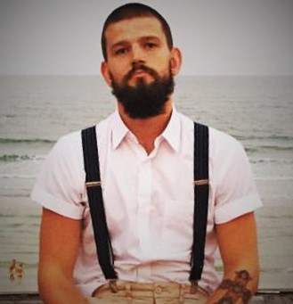

    

        <h3>Web</h3>
        <ul class="about-ul">
            <li>HTML / CSS</li>
            <li>Javascript</li>
            <li>Jekyll</li>
            <li>React / Gatsby</li>
            <li>Git</li>
         </ul>
    

    

            <h3>Graphic</h3>
        <ul class="about-ul">
            <li>Photoshop</li>
            <li>Illustrator</li>
            <li>Adobe XD</li>
        </ul>
    

Hi. 
I'm a 25 year old guy. In the fall of 2018 I started the frontend development education at Nackademin, school of business, in Solna. Together with my partner I live in an appartment in Hässelby.
On our sparetime we prefer to hang out with family and friends. I also spend alot of time fishing. Fishing has been a hobby for me a couple of years and I have attended a few contests. 
I'm a confident and calm person. I'm very driven and look forward to work with frontend development full time. 
My main goal is to become the best frontend developer that I possibly could be. I also want to develop knowledge in backend development to become as complete as possible within the field. 

  

    

      

      
      Formula 1
      

      

      
      Fishing
      

      

      
      Computers
      

      

      
      Technology
      

    

  

